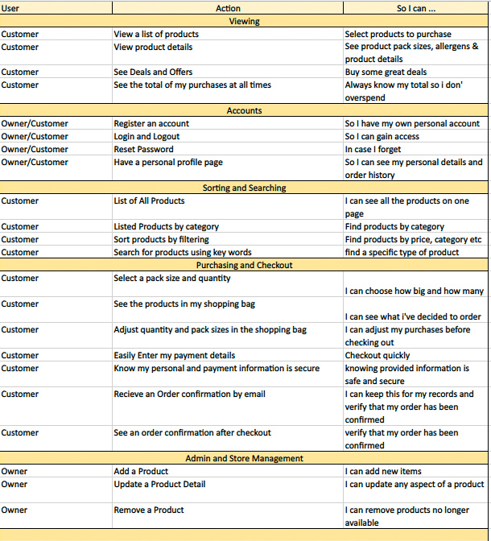
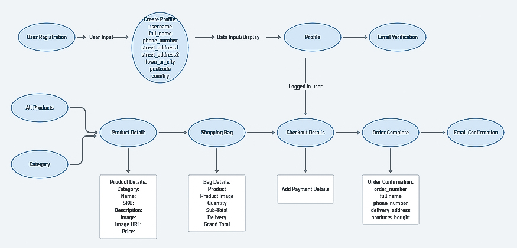
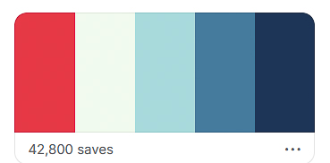

# **Crafty Bear Project**

Milestone 4 Project for the Code Institute. A Full Stack Framework e commerse website for a Dublin based micro brewery. The beer is actually real and i have been given premission from the owner to make a mock site. 

:file_folder: Table of Contents
======

**

UX
**
* [_Project Goals_](#project_goals)
* [_Target Users_](#target-users)
* [_User Stories_](#user-stories)

**

Features
**
* [_Exsisting Features_](#existing_features)
* [_Future Features_](#future_features)

**

Technologies
**
* [_Languages_](#languages)
* [_Libraries & Frameworks_](#libraries_&_frameworks)
* [_Wireframes_](#wireframes)
* [_Tools_](#tools)

**

Testing
**

**

Deployment
**

**

Issues
**

**

Credits
**

 

:bust_in_silhouette: UX
======

### **Project Goals**
* Make a Full Stack eCommerse Website
* With user authentication
* Using Stripe payments

### **Target users**
* Craft Beer fanatics
* People knew to craft beer
* People who want beer delivered to the door

### **User Stories**

### **Schema**

### **Fonts**
Using Noto Sans Display as my main font

### **Color**
From [coolor.co](https://coolors.co) Color Palattes

:electron: Features
======

### **Exsisting Features**
* Media responsive on all devices
* Navigation Buttons that link to all pages (Depending on user permissions)
* User registration, login and log out
* User verification
* User age verification
* Password protected accounts
* User profile page where order history can be viewed
* Admin can add, update and delete products
* Admin Blog page, where admin can inform users of upcoming brews
* Checkout Bag
* Secure checkout using Stripe.
* Order verification

### **Future Features**
To be added in the future:
* Login from social Media accounts

:computer: Technologies
======

### **Languages**

### **Libraries & Frameworks**

### **Wireframes**

### **Tools**

:stethoscope: Testing
======

### **User Stories Testing**

### ***HTML Validation***

### ***CSS Validation***

### ***JavaScript Validation***
[JShint](https://jshint.com/)
### ***Python Validation***
[PEP8online](http://pep8online.com/)

### ***Website Compatability***
### ***Device Responsiveness***

:biohazard: Bugs
======

:copyright: Credits
======

### **Code**
### **Media**
### **Other**
### **Acknowledgements**