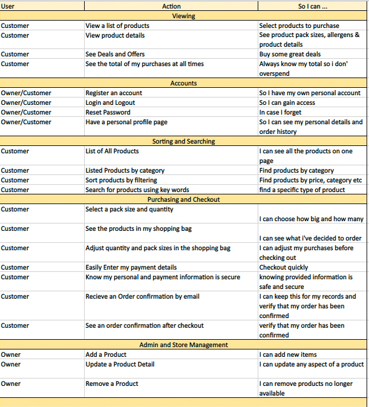

# **Crafty Bear Project**

Milestone 4 Project for the Code Institute. A Full Stack Framework e commerse website for a Dublin based micro brewery. The beer is actually real and i have been given premission from the owner to make a mock site. 

:file_folder: Table of Contents
======

**

UX
**
* [_Target Users_](#target-users)
* [_User Stories_](#user-stories)

**

Features
**

**

Technologies
**

**

Testing
**

**

Deployment
**

**

Issues
**

**

Credits
**

 

:bust_in_silhouette: UX
======
### **Target users**
* Craft Beer fanatics
* People knew to craft beer
* People who want beer delivered to the door

### **User Stories**

:electron: Features
======

### **Exsisting Features**

### **Future Features**
To be added in the future:

:computer: Technologies
======

### **Languages**

### **Libraries & Frameworks**

### **Wireframes**

### **Tools**

:stethoscope: Testing
======

### **User Stories Testing**

### ***HTML Validation***
[W3C Markup Validator](https://validator.w3.org/)
### ***CSS Validation***
[W3C Jigsaw](https://jigsaw.w3.org/css-validator/)
### ***JavaScript Validation***
[JShint](https://jshint.com/)
### ***Python Validation***
[PEP8online](http://pep8online.com/)

### ***Website Compatability***
### ***Device Responsiveness***

:biohazard: Bugs
======

:copyright: Credits
======

### **Code**
### **Media**
### **Other**
### **Acknowledgements**