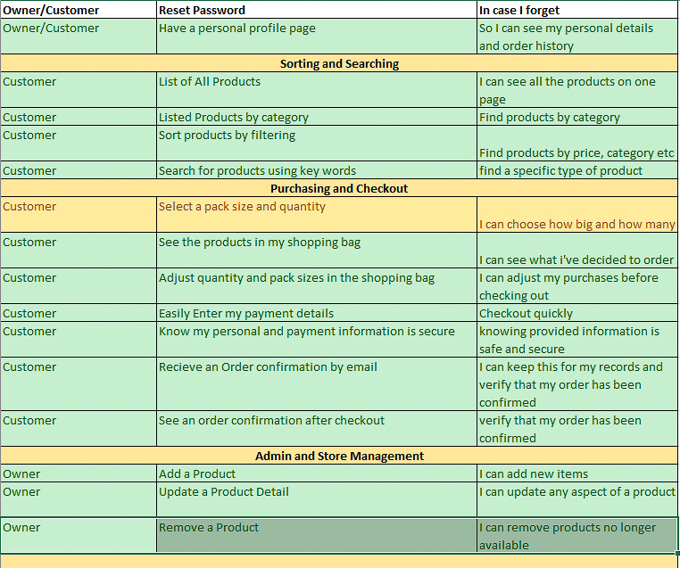
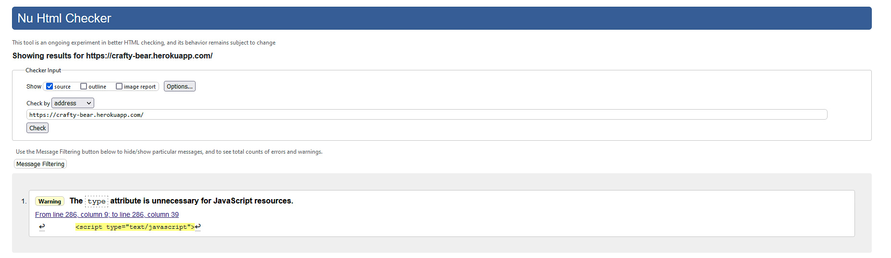
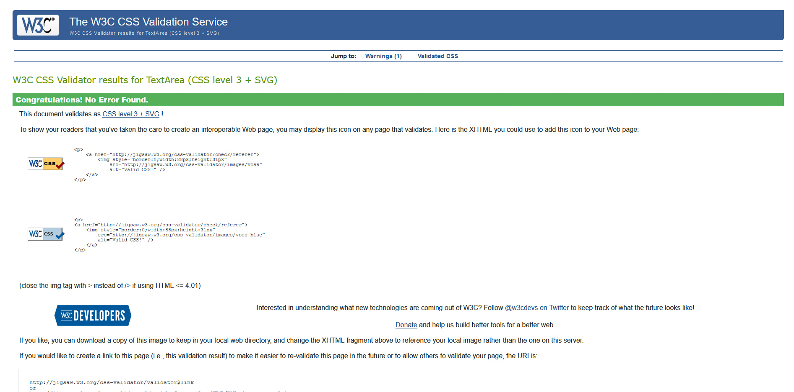
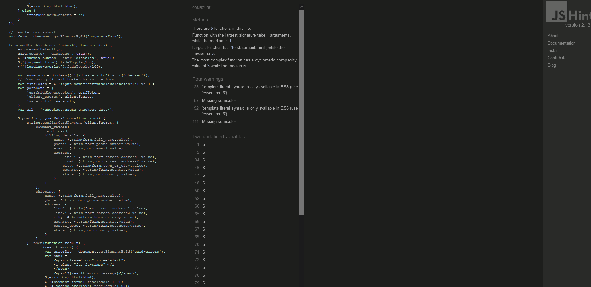
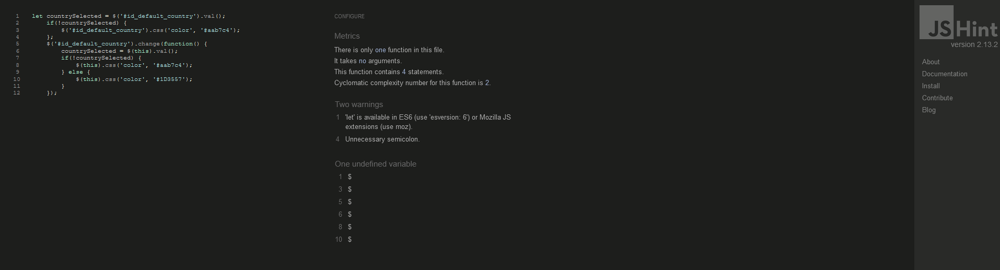

## ***Testing***

### ***User Stories Testing***

* After i started the project i decided to not do package sizes

* I did add a customer review section, that i had previously decided on.

### ***Test Accounts***

#### **Regular User**
* Usernamme: TestCustomer
* Password: demoaccount1

#### **Admin/Staff User**
* Username: Admin1
* Password: HarryB99

#### **Stripe**
* Card Number: 4242 4242 4242 4242
* Expiry: 04/24
* CVC: 242

### ***HTML Validation***

### ***CSS Validation***

#### **Checkout CSS file**

#### **Base CSS File**

### ***JavaScript Validation***
[JShint](https://jshint.com/)

#### **Static JS checkout file**

#### **Static JS profiles file**

### ***Python Validation***
[PEP8online](http://pep8online.com/)

### ***Website Compatability***

### ***Device Responsiveness***