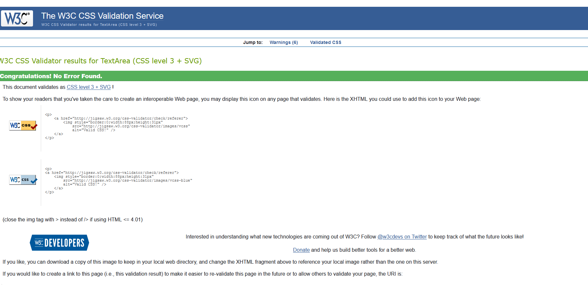
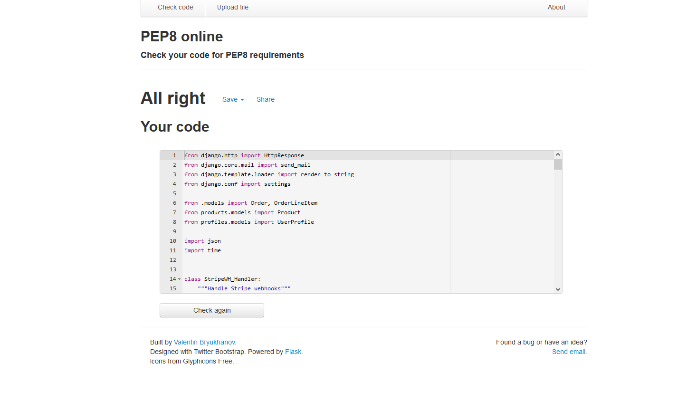

## ***Testing***

### ***User Stories Testing***

* After i started the project i decided to not do package sizes

* I did add a customer review section, that i had previously decided on.

:biohazard: Bugs
======

### Emails
* Trouble with the confirmation and verification emails stopped being sent once the project was deployed to heroku.
* Updated to the variable names on both settings.py and config settongs on heroku. Problem fixed, although there was no typo

### Stripe Webhooks. Are sending but timing out at the source end.
* I removed all but the payment webhooks

### Dependencies disapearing
* Throughout I had to reload all dependcies. I discovered this was due to a gitpod update. 

### ***HTML Validation***

### ***CSS Validation***

#### **Checkout CSS file**

#### **Base CSS File**

### ***JavaScript Validation***
[JShint](https://jshint.com/)

#### **Static JS checkout file**

#### **Static JS profiles file**

### ***Python Validation***
[PEP8online](http://pep8online.com/)

#### **Checkout Views**

#### **Profile Views**

#### **Webhook Handler**

## ***Performance Testing***

### **Lighthouse**

#### Desktop

#### Mobile
